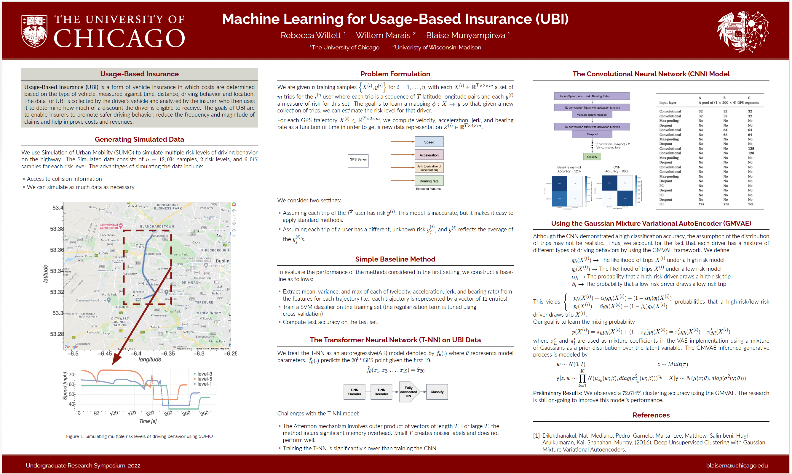


Hi there! 

I am currently working as an Engineer at <a href="https://www.groundlight.ai" style="text-decoration: none;">Groundlight AI </a>. Previously, I was an 
AI engineer at <a href="https://thirdai.com" style="text-decoration: none;">ThirdAI</a> where I worked on a variety of machine learning and engineering problems. Prior to that, I was a student at The University of Chicago where I double-majored in Computer Science and Computational and Applied Mathematics. I was fortunate enough to be advised by Professor <a href="https://willett.psd.uchicago.edu/" style="text-decoration: none;">Rebecca Willet</a> and to work with Professor <a href="https://raulcastrofernandez.com/" style="text-decoration: none;">Raul Castro Fernandez</a>.

My research interests, broadly defined, are in statistical machine learning and machine learning systems.
For the latter, I'm mostly excited about devising fast and hardware efficient algorithms for training and inferencing large language models. This involves leveraging sparsity patterns in both the data and the model. Previously, I have also worked on efficient algorithms for the classic Approximate Nearest Neighbor Search (ANNS) problem in high dimension using graph-based methods. 

Research
======

- <a href="https://www.redjournal.org/article/S0360-3016(19)34202-6/fulltext" style="text-decoration:none; color:CornflowerBlue">Deep Learning Detects Actionable Molecular and Clinical Features Directly from Head/Neck Squamous Cell Carcinoma Histopathology Slides</a>
*International Journal of Radiation Oncology*, 2020

-  [Machine Learning for Usage Based Insurance] 
  Poster presentation. Blaise Munyampirwa, Rebecca Willett and Willem Marais, 2022.
  

